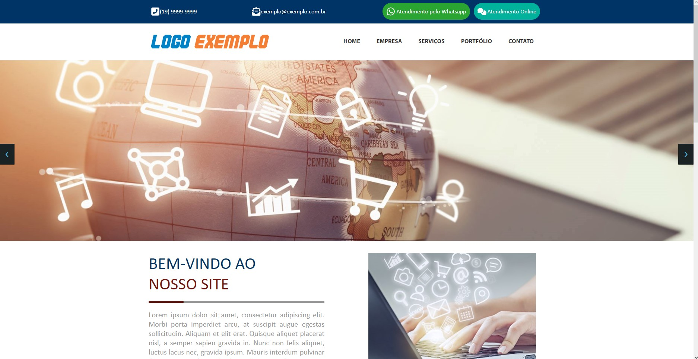
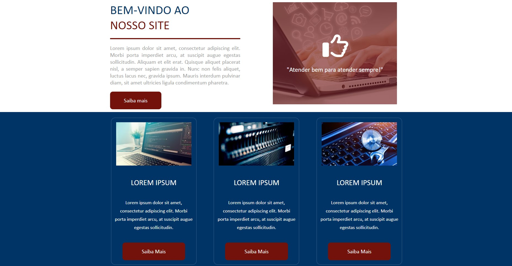
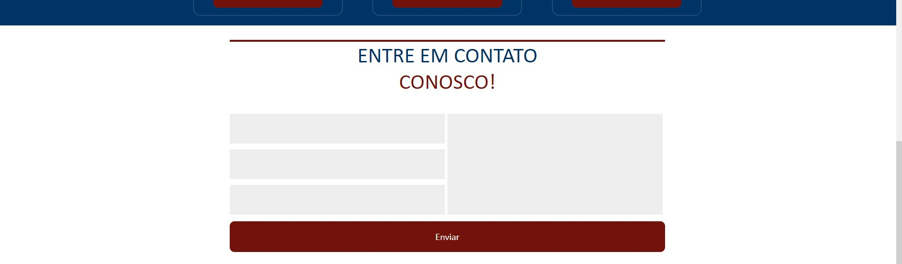
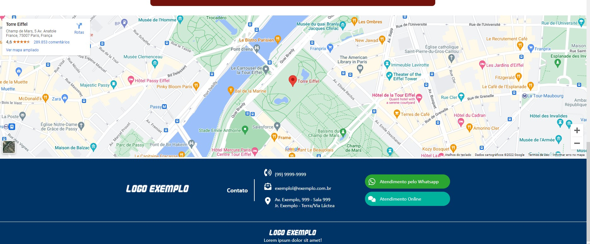

<h1 align="center">
    Site Exemplo 01
</h1>

## 💻 Sobre o projeto

Site desenvolvido em HTML,CSS e Javascript com a utilização de diversas tecnicas das linguagens sitadas, contendo varios componentes utilizados em sites profissionais.

---

## ⚙️ Funcionalidades

- Exemplifica um site profissional;
- Mostra links e dados de atendimento;
- Mostra um menu com diversas outras áreas do site;
- Dispõe um slide de imagens automático e manual;
- Possui uma área para mostrar as funções da empresa;
- Mostra a localização da empresa por meio do google maps integrado ao site;
- Dispõe os links e dados de atendimento também no rodapé.

---

## 📷 Imagens do projeto

  

  

  

  

---

## 🚀 Como executar o projeto

- Acessar o link: https://site-01-lucas-william.netlify.app;
- Ou executar o arquivo Index.HTML.

---

## 🛠 Tecnologias utilizadas

Foram utilizadas as seguintes ferramentas: HTML, CSS, Javascript.

---

## 👨‍💻 Autor
 
 <b>Lucas William Martins Lima</b>
  
 
---
